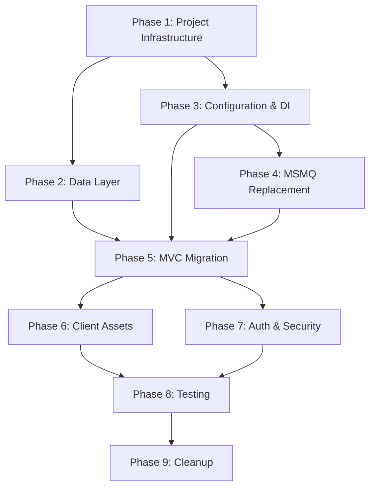

# Migration Tasks: ContosoUniversity (.NET Framework 4.8 → .NET 8)

## Task Hierarchy & Dependencies



---

## Phase 1: Project & Infrastructure
**Effort**: ~2 hours | **Dependencies**: None | **Risk**: Low

### Task 1.1 — Create SDK-style .csproj
**File**: `ContosoUniversity.csproj`

Replace the entire legacy project file:

```xml
<Project Sdk="Microsoft.NET.Sdk.Web">

  <PropertyGroup>
    <TargetFramework>net8.0</TargetFramework>
    <Nullable>enable</Nullable>
    <ImplicitUsings>enable</ImplicitUsings>
    <RootNamespace>ContosoUniversity</RootNamespace>
  </PropertyGroup>

  <ItemGroup>
    <PackageReference Include="Microsoft.EntityFrameworkCore.SqlServer" Version="8.0.11" />
    <PackageReference Include="Microsoft.EntityFrameworkCore.Tools" Version="8.0.11">
      <PrivateAssets>all</PrivateAssets>
      <IncludeAssets>runtime; build; native; contentfiles; analyzers</IncludeAssets>
    </PackageReference>
  </ItemGroup>

</Project>
```

### Task 1.2 — Create Program.cs (Minimal Hosting)
**File**: `Program.cs` (new)

```csharp
using ContosoUniversity.Data;
using ContosoUniversity.Services;
using Microsoft.EntityFrameworkCore;

var builder = WebApplication.CreateBuilder(args);

// Add services
builder.Services.AddControllersWithViews();
builder.Services.AddDbContext<SchoolContext>(options =>
    options.UseSqlServer(builder.Configuration.GetConnectionString("DefaultConnection")));
builder.Services.AddSingleton<INotificationService, InMemoryNotificationService>();

var app = builder.Build();

// Configure pipeline
if (!app.Environment.IsDevelopment())
{
    app.UseExceptionHandler("/Home/Error");
    app.UseHsts();
}

app.UseHttpsRedirection();
app.UseStaticFiles();
app.UseRouting();
app.UseAuthorization();

app.MapControllerRoute(
    name: "default",
    pattern: "{controller=Home}/{action=Index}/{id?}");

// Seed database in development
if (app.Environment.IsDevelopment())
{
    using var scope = app.Services.CreateScope();
    var context = scope.ServiceProvider.GetRequiredService<SchoolContext>();
    context.Database.EnsureCreated();
    DbInitializer.Initialize(context);
}

app.Run();
```

### Task 1.3 — Delete Legacy Startup Files
**Delete**:
- `Global.asax`
- `Global.asax.cs`
- `packages.config`
- `Properties/AssemblyInfo.cs`
- `App_Start/BundleConfig.cs`
- `App_Start/FilterConfig.cs`
- `App_Start/RouteConfig.cs`
- `Web.config` (root)
- `Views/Web.config`
- `ContosoUniversity.sln` (regenerate with `dotnet new sln`)

---

## Phase 2: Data Layer (EF Core 8)
**Effort**: ~1.5 hours | **Dependencies**: Phase 1 | **Risk**: Low

### Task 2.1 — Update SchoolContext for EF Core 8
**File**: `Data/SchoolContext.cs`

Minimal changes — EF Core 8 is backward-compatible with 3.1 model configuration. Key update:
- Remove explicit `datetime2` convention loop (EF Core 8 handles this natively)
- Keep TPH, composite key, and relationship configs

```csharp
using ContosoUniversity.Models;
using Microsoft.EntityFrameworkCore;

namespace ContosoUniversity.Data;

public class SchoolContext : DbContext
{
    public SchoolContext(DbContextOptions<SchoolContext> options) : base(options) { }

    public DbSet<Course> Courses => Set<Course>();
    public DbSet<Enrollment> Enrollments => Set<Enrollment>();
    public DbSet<Department> Departments => Set<Department>();
    public DbSet<OfficeAssignment> OfficeAssignments => Set<OfficeAssignment>();
    public DbSet<CourseAssignment> CourseAssignments => Set<CourseAssignment>();
    public DbSet<Person> People => Set<Person>();
    public DbSet<Student> Students => Set<Student>();
    public DbSet<Instructor> Instructors => Set<Instructor>();
    public DbSet<Notification> Notifications => Set<Notification>();

    protected override void OnModelCreating(ModelBuilder modelBuilder)
    {
        modelBuilder.Entity<Course>().ToTable("Course");
        modelBuilder.Entity<Enrollment>().ToTable("Enrollment");
        modelBuilder.Entity<Department>().ToTable("Department");
        modelBuilder.Entity<OfficeAssignment>().ToTable("OfficeAssignment");
        modelBuilder.Entity<CourseAssignment>().ToTable("CourseAssignment");
        modelBuilder.Entity<Notification>().ToTable("Notification");

        modelBuilder.Entity<Person>()
            .ToTable("Person")
            .HasDiscriminator<string>("Discriminator")
            .HasValue<Student>("Student")
            .HasValue<Instructor>("Instructor");

        modelBuilder.Entity<CourseAssignment>()
            .HasKey(c => new { c.CourseID, c.InstructorID });
    }
}
```

### Task 2.2 — Delete SchoolContextFactory
**Delete**: `Data/SchoolContextFactory.cs`

No longer needed — DI provides `SchoolContext` instances.

### Task 2.3 — Update DbInitializer
**File**: `Data/DbInitializer.cs`

Ensure it's a static method accepting `SchoolContext` (likely already is). Verify `DateTime` values use UTC or explicit kinds.

### Task 2.4 — Create Initial Migration
**Command**:
```bash
dotnet ef migrations add InitialCreate --context SchoolContext
```

---

## Phase 3: Configuration & Dependency Injection
**Effort**: ~1 hour | **Dependencies**: Phase 1 | **Risk**: Low

### Task 3.1 — Create appsettings.json
**File**: `appsettings.json` (new)

```json
{
  "ConnectionStrings": {
    "DefaultConnection": "Server=(localdb)\\mssqllocaldb;Database=ContosoUniversity;Trusted_Connection=True;MultipleActiveResultSets=true;TrustServerCertificate=True"
  },
  "Notifications": {
    "Provider": "InMemory"
  },
  "Logging": {
    "LogLevel": {
      "Default": "Information",
      "Microsoft.AspNetCore": "Warning"
    }
  },
  "AllowedHosts": "*"
}
```

### Task 3.2 — Create appsettings.Development.json
**File**: `appsettings.Development.json` (new)

```json
{
  "Logging": {
    "LogLevel": {
      "Default": "Debug",
      "Microsoft.AspNetCore": "Information",
      "Microsoft.EntityFrameworkCore.Database.Command": "Information"
    }
  }
}
```

### Task 3.3 — Remove All ConfigurationManager References
**Search & replace** in:
- `Services/NotificationService.cs` — will be rewritten (Phase 4)
- `Data/SchoolContextFactory.cs` — will be deleted (Task 2.2)
- `Global.asax.cs` — will be deleted (Task 1.3)

---

## Phase 4: MSMQ Replacement
**Effort**: ~2 hours | **Dependencies**: Phase 3 | **Risk**: High (behavioral change)

### Task 4.1 — Define INotificationService Interface
**File**: `Services/INotificationService.cs` (new)

```csharp
using ContosoUniversity.Models;

namespace ContosoUniversity.Services;

public interface INotificationService
{
    Task SendNotificationAsync(string entityType, string entityId,
        string? entityDisplayName, EntityOperation operation, string? userName = null);
    Task<Notification?> ReceiveNotificationAsync(CancellationToken cancellationToken = default);
    Task<List<Notification>> GetRecentNotificationsAsync(int count = 50);
}
```

### Task 4.2 — Implement InMemoryNotificationService
**File**: `Services/InMemoryNotificationService.cs` (new)

```csharp
using System.Threading.Channels;
using ContosoUniversity.Models;

namespace ContosoUniversity.Services;

public class InMemoryNotificationService : INotificationService
{
    private readonly Channel<Notification> _channel =
        Channel.CreateBounded<Notification>(new BoundedChannelOptions(1000)
        {
            FullMode = BoundedChannelFullMode.DropOldest
        });
    private readonly List<Notification> _history = [];
    private readonly Lock _lock = new();

    public async Task SendNotificationAsync(string entityType, string entityId,
        string? entityDisplayName, EntityOperation operation, string? userName = null)
    {
        var notification = new Notification
        {
            EntityType = entityType,
            EntityId = entityId,
            Operation = operation.ToString(),
            Message = $"{entityType} '{entityDisplayName ?? entityId}' was {operation.ToString().ToLower()}d",
            CreatedAt = DateTime.UtcNow,
            CreatedBy = userName ?? "System",
            IsRead = false
        };

        lock (_lock) { _history.Add(notification); }
        await _channel.Writer.WriteAsync(notification);
    }

    public async Task<Notification?> ReceiveNotificationAsync(CancellationToken ct = default)
    {
        try
        {
            if (await _channel.Reader.WaitToReadAsync(ct))
                return await _channel.Reader.ReadAsync(ct);
        }
        catch (OperationCanceledException) { }
        return null;
    }

    public Task<List<Notification>> GetRecentNotificationsAsync(int count = 50)
    {
        lock (_lock)
        {
            return Task.FromResult(_history.TakeLast(count).Reverse().ToList());
        }
    }
}
```

### Task 4.3 — Delete Legacy NotificationService
**Delete**: `Services/NotificationService.cs` (MSMQ-based)

### Task 4.4 — Update Notification Model
**File**: `Models/Notification.cs`

Remove any `System.Messaging` dependencies. Ensure model has an `Id` property for EF Core.

---

## Phase 5: MVC → ASP.NET Core
**Effort**: ~3 hours | **Dependencies**: Phases 2, 3, 4 | **Risk**: Medium

### Task 5.1 — Delete BaseController
**Delete**: `Controllers/BaseController.cs`

Replace inheritance pattern with constructor injection in each controller.

### Task 5.2 — Migrate StudentsController
**File**: `Controllers/StudentsController.cs`

Key changes:
- Replace `using System.Web.Mvc` → `using Microsoft.AspNetCore.Mvc`
- Add constructor injection for `SchoolContext` and `INotificationService`
- Replace `db` field → `_context`
- Replace `ActionResult` → `IActionResult` (optional but idiomatic)
- Replace `new HttpStatusCodeResult(HttpStatusCode.BadRequest)` → `BadRequest()`
- Replace `HttpNotFound()` → `NotFound()`
- Add `async/await` for EF queries

### Task 5.3 — Migrate CoursesController
**File**: `Controllers/CoursesController.cs` — Same pattern as 5.2

### Task 5.4 — Migrate InstructorsController
**File**: `Controllers/InstructorsController.cs` — Same pattern as 5.2

### Task 5.5 — Migrate DepartmentsController
**File**: `Controllers/DepartmentsController.cs` — Same pattern as 5.2

### Task 5.6 — Migrate NotificationsController
**File**: `Controllers/NotificationsController.cs`

Update to use `INotificationService` via DI.

### Task 5.7 — Migrate HomeController
**File**: `Controllers/HomeController.cs` — Simplest conversion.

### Task 5.8 — Create _ViewImports.cshtml
**File**: `Views/_ViewImports.cshtml` (new)

```cshtml
@using ContosoUniversity
@using ContosoUniversity.Models
@addTagHelper *, Microsoft.AspNetCore.Mvc.TagHelpers
```

### Task 5.9 — Update _Layout.cshtml
**File**: `Views/Shared/_Layout.cshtml`

Replace:
| MVC 5 | ASP.NET Core |
|-------|-------------|
| `@Styles.Render("~/Content/css")` | `<link rel="stylesheet" href="~/lib/bootstrap/css/bootstrap.min.css" />` |
| `@Scripts.Render("~/bundles/jquery")` | `<script src="~/lib/jquery/jquery.min.js"></script>` |
| `@Html.ActionLink("Text", "Action", "Ctrl", ...)` | `<a asp-controller="Ctrl" asp-action="Action">Text</a>` |
| `@RenderBody()` | `@RenderBody()` (unchanged) |
| `@RenderSection("scripts", required: false)` | `@await RenderSectionAsync("Scripts", required: false)` |

### Task 5.10 — Update All Views
**Files**: All `.cshtml` files in `Views/`

Replace in each view:
- `@Html.ActionLink(...)` → `<a asp-action="..." asp-controller="...">` Tag Helpers
- `@Html.BeginForm(...)` → `<form asp-action="..." asp-controller="..." method="post">`
- `@Html.DisplayNameFor(...)` → keep (still works) or use `<label asp-for="...">`
- `@Html.EditorFor(...)` → `<input asp-for="..." class="form-control" />`
- `@Html.ValidationMessageFor(...)` → `<span asp-validation-for="..." class="text-danger"></span>`
- `@Html.HiddenFor(...)` → `<input asp-for="..." type="hidden" />`
- `@Html.DropDownList(...)` → `<select asp-for="..." asp-items="..."></select>`

### Task 5.11 — Update _ViewStart.cshtml
**File**: `Views/_ViewStart.cshtml`

```cshtml
@{
    Layout = "_Layout";
}
```

### Task 5.12 — Update PaginatedList.cs
**File**: `PaginatedList.cs`

Replace `System.Web.Mvc` references if any. Update to use `IQueryable<T>` async extensions from EF Core 8.

---

## Phase 6: Client Assets & Styling
**Effort**: ~1 hour | **Dependencies**: Phase 5 | **Risk**: Low

### Task 6.1 — Create wwwroot Structure
**Create directories**:
```
wwwroot/
├── css/
├── js/
└── lib/
```

### Task 6.2 — Move CSS Files
- `Content/Site.css` → `wwwroot/css/site.css`
- `Content/notifications.css` → `wwwroot/css/notifications.css`

### Task 6.3 — Move JS Files
- `Scripts/notifications.js` → `wwwroot/js/notifications.js`

### Task 6.4 — Add LibMan for Client Libraries
**File**: `libman.json` (new)

```json
{
  "version": "1.0",
  "defaultProvider": "cdnjs",
  "libraries": [
    {
      "library": "twitter-bootstrap@5.3.3",
      "destination": "wwwroot/lib/bootstrap/"
    },
    {
      "library": "jquery@3.7.1",
      "destination": "wwwroot/lib/jquery/"
    },
    {
      "library": "jquery-validate@1.21.0",
      "destination": "wwwroot/lib/jquery-validation/"
    },
    {
      "library": "jquery-validation-unobtrusive@4.0.0",
      "destination": "wwwroot/lib/jquery-validation-unobtrusive/"
    }
  ]
}
```

### Task 6.5 — Delete Legacy Static File Folders
**Delete**:
- `Scripts/` (entire folder)
- `Content/` (entire folder)

---

## Phase 7: Authentication & Security
**Effort**: ~30 min | **Dependencies**: Phase 5 | **Risk**: Low

### Task 7.1 — Configure Auth Middleware
Already in `Program.cs` (Task 1.2): `app.UseAuthorization()`

For now, keep anonymous access. If auth is needed later:
```csharp
builder.Services.AddAuthentication(/* scheme */);
builder.Services.AddAuthorization();
```

### Task 7.2 — Verify CSRF Protection
- Tag Helper `<form>` automatically includes anti-forgery tokens
- Verify all `[HttpPost]` actions work with `[ValidateAntiForgeryToken]`
- ASP.NET Core adds `[AutoValidateAntiforgeryToken]` globally if configured

### Task 7.3 — Add Global Anti-Forgery Filter (Optional)
**In Program.cs**:
```csharp
builder.Services.AddControllersWithViews(options =>
{
    options.Filters.Add(new AutoValidateAntiforgeryTokenAttribute());
});
```

### Task 7.4 — Remove Windows Auth Config
- No more `<IISExpressWindowsAuthentication>enabled</IISExpressWindowsAuthentication>`
- No more `Web.config` auth sections
- Already handled by deleting legacy files

---

## Phase 8: Testing & Validation
**Effort**: ~2 hours | **Dependencies**: Phases 6, 7 | **Risk**: Low

### Task 8.1 — Create Test Project
**Command**:
```bash
dotnet new xunit -n ContosoUniversity.Tests
dotnet sln add ContosoUniversity.Tests
cd ContosoUniversity.Tests
dotnet add reference ../ContosoUniversity/ContosoUniversity.csproj
dotnet add package Microsoft.AspNetCore.Mvc.Testing
dotnet add package Microsoft.EntityFrameworkCore.InMemory
```

### Task 8.2 — Add Integration Tests
**File**: `ContosoUniversity.Tests/EndpointTests.cs`

```csharp
using Microsoft.AspNetCore.Mvc.Testing;

namespace ContosoUniversity.Tests;

public class EndpointTests : IClassFixture<WebApplicationFactory<Program>>
{
    private readonly HttpClient _client;

    public EndpointTests(WebApplicationFactory<Program> factory)
    {
        _client = factory.CreateClient();
    }

    [Theory]
    [InlineData("/")]
    [InlineData("/Home/About")]
    [InlineData("/Students")]
    [InlineData("/Courses")]
    [InlineData("/Instructors")]
    [InlineData("/Departments")]
    [InlineData("/Notifications")]
    public async Task Get_Endpoints_ReturnSuccess(string url)
    {
        var response = await _client.GetAsync(url);
        Assert.Equal(System.Net.HttpStatusCode.OK, response.StatusCode);
    }
}
```

### Task 8.3 — Add NotificationService Unit Tests
**File**: `ContosoUniversity.Tests/NotificationServiceTests.cs`

```csharp
using ContosoUniversity.Models;
using ContosoUniversity.Services;

namespace ContosoUniversity.Tests;

public class NotificationServiceTests
{
    [Fact]
    public async Task SendNotification_AddsToHistory()
    {
        var service = new InMemoryNotificationService();
        await service.SendNotificationAsync("Student", "1", "John", EntityOperation.Created);

        var history = await service.GetRecentNotificationsAsync();
        Assert.Single(history);
        Assert.Contains("Student", history[0].EntityType);
    }
}
```

### Task 8.4 — Build Validation
**Command**:
```bash
dotnet build --warnaserror
dotnet test
```

---

## Phase 9: Cleanup & Optimization
**Effort**: ~1 hour | **Dependencies**: Phase 8 (all tests pass) | **Risk**: Low

### Task 9.1 — Delete All Legacy Files
**Verify deleted** (should already be done in earlier phases):
- [ ] `Global.asax` / `Global.asax.cs`
- [ ] `packages.config`
- [ ] `Properties/AssemblyInfo.cs`
- [ ] `App_Start/` (entire folder)
- [ ] `Web.config` (root + Views/Web.config)
- [ ] `Data/SchoolContextFactory.cs`
- [ ] `Services/NotificationService.cs` (MSMQ version)
- [ ] `Scripts/` folder
- [ ] `Content/` folder

### Task 9.2 — Remove Obsolete Using Statements
Search all `.cs` files and remove:
- `using System.Web;`
- `using System.Web.Mvc;`
- `using System.Web.Optimization;`
- `using System.Web.Routing;`
- `using System.Configuration;`
- `using System.Messaging;`

### Task 9.3 — Update Namespace Conventions (Optional)
Convert to file-scoped namespaces:
```csharp
// Before
namespace ContosoUniversity.Controllers
{
    public class StudentsController : Controller { }
}

// After
namespace ContosoUniversity.Controllers;

public class StudentsController : Controller { }
```

### Task 9.4 — Run Code Formatting
```bash
dotnet format
```

### Task 9.5 — Regenerate Solution File
```bash
dotnet new sln -n ContosoUniversity --force
dotnet sln add ContosoUniversity/ContosoUniversity.csproj
dotnet sln add ContosoUniversity.Tests/ContosoUniversity.Tests.csproj
```

### Task 9.6 — Final Validation Checklist
- [ ] `dotnet build` — zero errors, zero warnings
- [ ] `dotnet test` — all tests pass
- [ ] `dotnet run` — app starts, homepage loads at https://localhost:5001
- [ ] Students CRUD works
- [ ] Courses CRUD works
- [ ] Notifications page loads
- [ ] No `System.Web` references remain

---

## Summary Table

| Phase | Tasks | Effort | Risk | Key Blocker |
|-------|-------|--------|------|-------------|
| 1. Project Infrastructure | 3 | 2h | Low | None |
| 2. Data Layer | 4 | 1.5h | Low | EF Core 8 migration compatibility |
| 3. Configuration & DI | 3 | 1h | Low | None |
| 4. MSMQ Replacement | 4 | 2h | **High** | Behavioral equivalence |
| 5. MVC Migration | 12 | 3h | Medium | View syntax changes (bulk) |
| 6. Client Assets | 5 | 1h | Low | None |
| 7. Auth & Security | 4 | 0.5h | Low | None |
| 8. Testing | 4 | 2h | Low | None |
| 9. Cleanup | 6 | 1h | Low | None |
| **Total** | **45** | **~14h** | | |
